# Application

[](https://github.com/janeirodigital/sai-js/actions/workflows/ci.yml)
[](https://codecov.io/gh/janeirodigital/sai-js/tree/codecov/packages/application)
[](https://gitter.im/solid/data-interoperability-panel)
[](https://www.npmjs.com/package/@janeirodigital/interop-application)
[](https://github.com/janeirodigital/sai-js/blob/main/LICENSE)

## Early access

[Specifications](https://github.com/solid/data-interoperability-panel#solid-application-interoperability)
this library implements are still a work in progress. While we track changes
to the public API of this library with semver, the underlying data will be slightly changing
for the rest of 2021. We are commited to keep this implementation up to date.
If you plan to use your application in production please ask the specification editors
on the [public chatroom](https://gitter.im/solid/data-interoperability-panel)
about the stability of the data model.

## Overview

```mermaid
flowchart TB

  subgraph Resource Owners
    Alice["👩 Alice"]
    ACME["🏢 ACME"]
    Bob["👨 Bob"]
  end

  subgraph Resource Servers
    AlHome["☁️ Home"]
    AlWork["☁️ Work"]
    AcRnd["☁️ R&D"]
    AcHr["☁️ HR"]
  end

  subgraph Scopes
    AlHProjects("🗄️ Projects")
    AlHTasks("🗄️ Tasks")
    AlWCalendars("🗄️ Calendars")
    AcRProjects("🗄️ Projects")
    AcRTasks("🗄️ Tasks")
    AcHProjects("🗄️ Projects")
    AcHTasks("🗄️ Tasks")
  end

  subgraph Resources
    AlHP1("📄 P1")
    AlHP2("📄 P1")
    AlHT1("📄 T1")
    AlHT2("📄 T2")
  end

  Alice -- :storage --> AlHome
  Alice -- :storage --> AlWork
  ACME -- :storage --> AcRnd
  ACME -- :storage --> AcHr

  AlHome -- :hosts --> AlHProjects
  AlHome -- :hosts --> AlHTasks
  AlWork -- :hosts --> AlWCalendars
  AcRnd -- :hosts --> AcRProjects
  AcRnd -- :hosts --> AcRTasks
  AcHr -- :hosts --> AcHProjects
  AcHr -- :hosts --> AcHTasks
  AlHProjects -- :contains --> AlHP1
  AlHProjects -- :contains --> AlHP2
  AlHTasks -- :contains --> AlHT1
  AlHTasks -- :contains --> AlHT2
```



## Example

```ts
import { DatasetCore } from '@rdfjs/types';
import { Application } from '@janeirodigital/interop-application';
import { DataInstance } from '@janeirodigital/interop-data-model';
import { Session } from '@inrupt/solid-client-authn-node';
import { randomUUID } from 'crypto';
import { Store } from 'n3';

class Custom {
  localDataset: DatasetCore;

  constructor(private dataInstance: DataInstance) {
    this.localDataset = new Store([...dataInstance.dataset]);
  }

  delete(): Promise<void> {
    return this.dataInstance.delete();
  }

  update(): Promise<void> {
    return this.dataInstance.update(this.localDataset);
  }

  get dataset(): DatasetCore {
    return this.dataInstance.dataset;
  }

  set name(name: string): void {
    // manipulate this.localDataset to change project name
  }
}

class Project extends Custom {
  static shapeTree = 'https://solidshapes.example/trees/Project';
}
class Task extends Custom {
  static shapeTree = 'https://solidshapes.example/trees/Task';
}

(async function () {
  // authentication is handled by separate library
  // for example https://docs.inrupt.com/developer-tools/javascript/client-libraries/authentication/

  const session = new Session();
  await session.login({
    /* options */
  });

  // For simplicity we ommit handing redirect to user's Solid-OIDC Provider
  // Following lines assume session.info.isLoggedIn === true

  // IRI used as client_id of the application, see: https://solidproject.org/TR/oidc#clientids-document
  const applicationID = 'https://projectron.example/';

  // create new application
  // fetch needs to take care of authentication
  const application = await Application.build(session.info.webId, applicationId, { fetch: session.fetch, randomUUID });

  // if application wasn't authorized it needs to be redirected to user's authorization agent
  if (!application.hasApplicationRegistration) {
    window.location.href = application.authorizationRedirectUri;
  }

  // application provides list of all data owners
  // we can find one matching currently logged in user
  const user = application.dataOwners.find((agent) => agent.iri === session.info.webId);

  const projects = [];
  // agent has one or more data registrations
  for (const registration of user.selectRegistrations(Project.shapeTree)) {
    // registration provides async iterator of Data Instances from that data registration
    for await (const dataInstance of registration.dataInstances) {
      // data instance will provide RDFJS DatasetCore with all the data
      // one can create app specific instances
      projects.push(new Project(dataInstance));
    }
  }

  // DataInstance#delete
  const projectToDelete = projects.find(/* logic */);
  try {
    await projectToDelete.delete();
  } catch (e) {
    // handle error
  }

  // DataInstance#update
  const projectToUpdate = projects.find(/* logic */);
  projectToUpdate.name = 'Very very important thing';
  try {
    await projectToUpdate.update();
  } catch (e) {
    // handle error
  }

  // DataRegistrationProxy#newDataInstance
  const registration = user.selectRegistrations(Project.shapeTree).find(/* logic */);
  const newProject = new Project(registration.newDataInstance());
  newProject.name = 'Another thing';
  try {
    await newProject.update();
  } catch (e) {
    // handle error
  }

  // for inherited grants DataRegistrationProxy#newDataInstance parent data instance is required
  // for that reason also data instance acting as parent provides convienience method
  const projectToCreateTaskIn = projects.find(/* logic */);
  const newTask = new Task(projectToCreateTaskIn.newChildDataInstance(Task.shapeTree));
  newTask.name = 'some task';
  try {
    await newTask.update();
  } catch (e) {
    // handle error
  }
})();
```
## Funding

This project is funded through the [NGI Zero Entrust Fund](https://nlnet.nl/entrust), a fund established by [NLnet](https://nlnet.nl) with financial support from the European Commission's [Next Generation Internet](https://ngi.eu) program. Learn more at the [NLnet project page](https://nlnet.nl/project/SolidInterop3).

[](https://nlnet.nl)

[](https://nlnet.nl/entrust)
